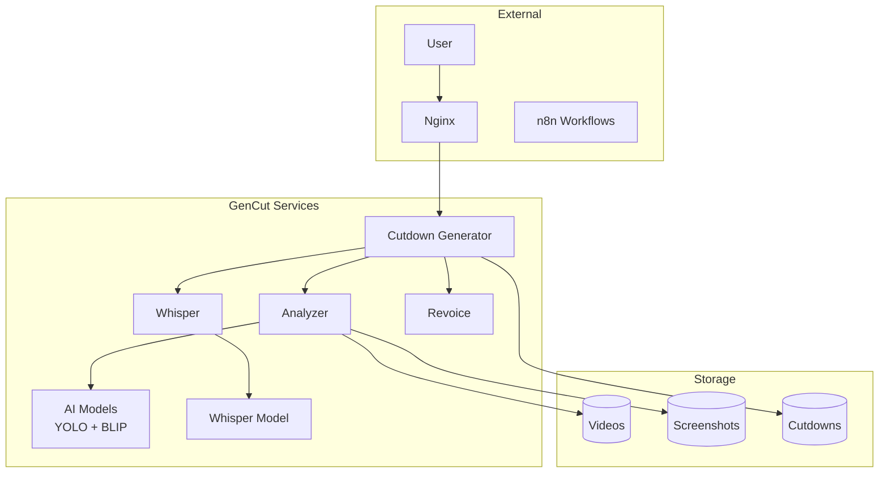

# 🔍 GenCut - Code-Qualitätsbericht & Verbesserungsempfehlungen

## 📊 Executive Summary

**Gesamtbewertung**: ⭐⭐⭐ (3.2/5.0)

| Kategorie | Bewertung | Kommentar |
|-----------|-----------|-----------|
| Sicherheit | 🔴 2.0/5.0 | Kritische Sicherheitslücken |
| Architektur | 🟢 4.5/5.0 | Sehr gute Microservice-Struktur |
| Code-Qualität | 🟡 3.0/5.0 | Gemischt, große Verbesserungen möglich |
| Dokumentation | 🟡 2.5/5.0 | Grundlegend vorhanden, aber unvollständig |
| Testabdeckung | 🔴 1.0/5.0 | Praktisch keine Tests vorhanden |
| Performance | 🟢 4.0/5.0 | Gut optimiert für AI-Workloads |

---

## 🔴 Kritische Sicherheitsprobleme

### 1. **Hardcodierte API-Schlüssel**

**Problem**: ElevenLabs API-Schlüssel sind direkt im Code gespeichert
```python
# ❌ services/cutdown-generator/app.py:17
ELEVENLABS_API_KEY = os.environ.get('ELEVENLABS_API_KEY', 'sk_76fa8e172a657a24769b7714e73bf966e1e3297583c6a7ca')

# ❌ services/revoice/app.py:45  
ELEVENLABS_API_KEY = 'sk_76fa8e172a657a24769b7714e73bf966e1e3297583c6a7ca'
```

**Risiko**: 🔴 **KRITISCH** - API-Schlüssel öffentlich sichtbar, Missbrauch möglich

**Lösung**:
```python
# ✅ Sichere Implementierung
import os
from typing import Optional

class Config:
    ELEVENLABS_API_KEY: Optional[str] = os.environ.get('ELEVENLABS_API_KEY')
    
    def __post_init__(self):
        if not self.ELEVENLABS_API_KEY:
            raise ValueError("ELEVENLABS_API_KEY Umgebungsvariable ist erforderlich")

# ✅ Docker Compose
environment:
  - ELEVENLABS_API_KEY=${ELEVENLABS_API_KEY}
```

### 2. **Debug-Modus in Produktion**

**Problem**: Debug-Modus ist standardmäßig aktiviert
```python
# ❌ Mehrere Services
app.config.update(DEBUG=True, ENV='development')
app.run(host='0.0.0.0', port=5679, debug=True)
```

**Risiko**: 🔴 **HOCH** - Sensible Informationen in Fehlermeldungen

**Lösung**:
```python
# ✅ Umgebungsbasierte Konfiguration
DEBUG = os.environ.get('DEBUG', 'false').lower() == 'true'
ENV = os.environ.get('FLASK_ENV', 'production')

app.config.update(DEBUG=DEBUG, ENV=ENV)
```

### 3. **Fehlende Input-Validierung**

**Problem**: Unvalidierte Benutzereingaben
```python
# ❌ services/analyzer/main.py:332
data = await request.json()
video_path = data.get("file")  # Keine Validierung
start = data.get("start")      # Keine Validierung
```

**Risiko**: 🟡 **MITTEL** - Path Traversal, Code Injection möglich

**Lösung**:
```python
# ✅ Mit Pydantic-Validierung
from pydantic import BaseModel, validator
import os.path

class CutdownRequest(BaseModel):
    file: str
    start: float
    end: float
    
    @validator('file')
    def validate_file_path(cls, v):
        if not os.path.exists(v):
            raise ValueError(f"Datei nicht gefunden: {v}")
        if '..' in v:  # Verhindere Path Traversal
            raise ValueError("Ungültiger Dateipfad")
        return v
    
    @validator('start', 'end')
    def validate_times(cls, v):
        if v < 0:
            raise ValueError("Zeit muss positiv sein")
        return v
```

---

## 📐 Architektur-Bewertung

### ✅ **Stärken**

#### 1. **Saubere Microservice-Trennung**
```
analyzer     → Video-Analyse & KI
whisper      → Speech-to-Text
cutdown-gen  → Frontend & Orchestrierung  
revoice      → Voice-Processing
```
**Bewertung**: ⭐⭐⭐⭐⭐ Exzellent

#### 2. **Docker-Integration**
- Alle Services containerisiert
- Shared Volumes für Daten
- Netzwerk-Isolation
**Bewertung**: ⭐⭐⭐⭐⭐ Exzellent

#### 3. **API-Design**
- RESTful Endpunkte
- JSON-Responses
- HTTP-Status-Codes korrekt verwendet
**Bewertung**: ⭐⭐⭐⭐ Sehr gut

### ⚠️ **Verbesserungsbereiche**

#### 1. **Service-Duplikation**
```
services/upload-service/     # Legacy?
services/cutdown-generator/  # Aktiv
services/revoice/           # Ähnliche Upload-Logik
```
**Problem**: Code-Duplikation, Verwirrung
**Lösung**: Konsolidierung oder klare Abgrenzung

#### 2. **Fehlende Service-Discovery**
```python
# ❌ Hardcodierte Service-URLs
response = requests.post("http://whisper:9000/asr", ...)
response = requests.post("http://n8n:5678/webhook/video", ...)
```
**Lösung**: Konfigurierbare Service-URLs

---

## 💻 Code-Qualitäts-Analyse

### 📄 **Datei-spezifische Bewertungen**

#### `services/analyzer/main.py` (800+ Zeilen)
**Bewertung**: ⭐⭐⭐ (3.0/5.0)

**✅ Positiv:**
- Umfangreiche Funktionalität
- Gute Async/Await-Nutzung
- Robuste Fehlerbehandlung

**❌ Problematisch:**
```python
# Zu lange Funktionen
async def generate_cutdown_v2(request: dict):  # 200+ Zeilen
    # Sollte in kleinere Funktionen aufgeteilt werden

# Fehlende Type-Hints
def time_string_to_seconds(time_str):  # Sollte: -> float
def normalize_video_path(input_path):  # Sollte: -> str
```

**Verbesserung**:
```python
# ✅ Aufgeteilte Funktionen
async def generate_cutdown_v2(request: dict) -> JSONResponse:
    scenes = _validate_and_extract_scenes(request)
    base_video = _resolve_base_video_path(request, scenes)
    scene_files = await _cut_individual_scenes(scenes, base_video)
    final_video = await _concatenate_scenes(scene_files, request.get('audio_file'))
    return JSONResponse(content={"output_url": final_video})

def _validate_and_extract_scenes(request: dict) -> List[Dict[str, Any]]:
    """Extrahiert und validiert Szenen aus Request."""
    pass

def _resolve_base_video_path(request: dict, scenes: List[Dict]) -> str:
    """Ermittelt Basis-Video-Pfad.""" 
    pass
```

#### `services/cutdown-generator/app.py` (630+ Zeilen)
**Bewertung**: ⭐⭐⭐ (3.0/5.0)

**✅ Positiv:**
- Flask-Integration gut gemacht
- Umfangreiche API
- n8n-Integration funktional

**❌ Problematisch:**
```python
# Gemischte Verantwortlichkeiten
@app.route('/upload', methods=['POST'])          # File Upload
@app.route('/generate-music', methods=['POST'])  # Music Generation  
@app.route('/elevenlabs/voices')                # Voice Management
@app.route('/check-status', methods=['POST'])   # Status Checking
```

**Verbesserung**: Aufteilen in Blueprint-Module:
```python
# ✅ Modulare Struktur
from flask import Blueprint

upload_bp = Blueprint('upload', __name__)
music_bp = Blueprint('music', __name__)
voice_bp = Blueprint('voice', __name__)
status_bp = Blueprint('status', __name__)

# Separate Dateien für jeden Blueprint
```

#### `services/whisper/main.py` (49 Zeilen)
**Bewertung**: ⭐⭐⭐⭐⭐ (5.0/5.0)

**✅ Exzellent:**
- Fokussierte Funktionalität
- Sauberer Code
- Korrekte Ressourcen-Verwaltung
- Gute Async-Implementation

```python
# ✅ Beispiel für sauberen Code
@app.post("/asr")
async def transcribe_audio(audio_file: UploadFile = File(...), 
                          language_code: str = Form(None)):
    try:
        with tempfile.NamedTemporaryFile(delete=False, suffix=".wav") as tmp_file:
            content = await audio_file.read()
            tmp_file.write(content)
            tmp_file_path = tmp_file.name
        
        try:
            result = model.transcribe(tmp_file_path, language=language_code)
            return {"text": result["text"], "language": result.get("language")}
        finally:
            if os.path.exists(tmp_file_path):
                os.unlink(tmp_file_path)
    except Exception as e:
        return JSONResponse(status_code=500, content={"error": str(e)})
```

---

## 🧪 Testing & Qualitätssicherung

### ❌ **Aktueller Zustand**: Keine Tests vorhanden

**Risiko**: 🔴 **KRITISCH** - Keine Qualitätssicherung

### ✅ **Empfohlene Test-Struktur**

```python
# tests/test_analyzer.py
import pytest
from fastapi.testclient import TestClient
from services.analyzer.main import app

client = TestClient(app)

class TestAnalyzer:
    def test_health_endpoint(self):
        response = client.get("/health")
        assert response.status_code == 200
        
    def test_analyze_video_success(self):
        with open("fixtures/sample.mp4", "rb") as f:
            response = client.post("/analyze", files={"file": f})
        assert response.status_code == 200
        assert "scenes" in response.json()
        
    def test_analyze_video_invalid_format(self):
        with open("fixtures/sample.txt", "rb") as f:
            response = client.post("/analyze", files={"file": f})
        assert response.status_code == 400

# tests/test_whisper.py  
class TestWhisper:
    def test_transcribe_german_audio(self):
        with open("fixtures/german_sample.wav", "rb") as f:
            response = client.post("/asr", 
                files={"audio_file": f},
                data={"language_code": "de"})
        assert response.status_code == 200
        assert response.json()["language"] == "de"

# tests/test_integration.py
class TestIntegration:
    def test_full_video_pipeline(self):
        # 1. Upload Video
        # 2. Analyze Scenes  
        # 3. Generate Cutdown
        # 4. Verify Result
        pass
```

### 🔧 **CI/CD Pipeline**

```yaml
# .github/workflows/test.yml
name: Tests
on: [push, pull_request]

jobs:
  test:
    runs-on: ubuntu-latest
    steps:
      - uses: actions/checkout@v3
      - name: Build Services
        run: docker-compose -f docker-compose.test.yml build
      - name: Run Tests
        run: docker-compose -f docker-compose.test.yml run tests
      - name: Security Scan
        run: |
          pip install bandit safety
          bandit -r services/
          safety check
```

---

## 📊 Performance-Analyse

### ✅ **Gut optimiert**

#### 1. **AI-Model Loading**
```python
# ✅ Singleton Pattern für Modelle
visual_analyzer = VisualAnalyzer()

# ✅ Async Model Initialization  
@app.on_event("startup")
async def startup_event():
    await visual_analyzer.initialize()
```

#### 2. **Video Processing**
```python
# ✅ Optimierte FFmpeg-Parameter
cmd = [
    "ffmpeg", "-i", input_path,
    "-ss", str(start_time),
    "-t", str(duration),
    "-preset", "ultrafast",  # Schnelle Verarbeitung
    "-crf", "23",           # Gute Qualität/Größe-Balance
    output_path
]
```

#### 3. **Screenshot-Generierung**
```python
# ✅ Nur mittlere Frames pro Szene
frame_numbers = [start_frame + (end_frame - start_frame) // 2]

# ✅ Komprimierte Screenshots
cv2.imwrite(screenshot_path, frame, [cv2.IMWRITE_JPEG_QUALITY, 85])
```

### ⚠️ **Verbesserungsmöglichkeiten**

#### 1. **Memory Management**
```python
# ❌ Potentielle Memory Leaks
def analyze_scenes(video_path: str):
    cap = cv2.VideoCapture(video_path)
    # ... processing
    cap.release()  # ✅ Gut - wird gemacht
    
# ⚠️ Aber: Keine explizite Garbage Collection für große Objekte
```

**Verbesserung**:
```python
# ✅ Explizite Speicher-Bereinigung
import gc

def analyze_scenes(video_path: str):
    try:
        cap = cv2.VideoCapture(video_path)
        # ... processing
    finally:
        cap.release()
        gc.collect()  # Explizite Garbage Collection
```

#### 2. **Caching**
```python
# ❌ Keine Caching-Strategie
@app.post("/analyze")
async def analyze_video(file: UploadFile = File(...)):
    # Jedes Mal komplette Neuanalyse
```

**Verbesserung**:
```python
# ✅ Redis-basiertes Caching
import redis
import hashlib

redis_client = redis.Redis(host='redis', port=6379)

async def analyze_video(file: UploadFile = File(...)):
    # Hash der Datei als Cache-Key
    content = await file.read()
    file_hash = hashlib.md5(content).hexdigest()
    
    # Prüfe Cache
    cached_result = redis_client.get(f"analysis:{file_hash}")
    if cached_result:
        return json.loads(cached_result)
    
    # Analyse durchführen
    result = await _analyze_video_content(content)
    
    # In Cache speichern (24h TTL)
    redis_client.setex(f"analysis:{file_hash}", 86400, json.dumps(result))
    return result
```

---

## 📝 Dokumentations-Bewertung

### ⚠️ **Aktueller Zustand**: Grundlegend vorhanden

**Bewertung**: ⭐⭐⭐ (2.5/5.0)

**✅ Vorhanden:**
- README-Dateien mit Setup-Anweisungen
- Function-Descriptions für API
- Docker-Compose-Dokumentation

**❌ Fehlend:**
- Inline-Code-Dokumentation
- API-Schema-Dokumentation
- Architektur-Diagramme
- Deployment-Guide

### ✅ **Empfohlene Verbesserungen**

#### 1. **OpenAPI/Swagger-Dokumentation**
```python
# ✅ FastAPI automatische API-Docs
from fastapi import FastAPI

app = FastAPI(
    title="GenCut Analyzer API",
    description="Video-Analyse und KI-basierte Szenen-Erkennung",
    version="1.0.0",
    docs_url="/docs",
    redoc_url="/redoc"
)

@app.post("/analyze", 
    summary="Video analysieren",
    description="Analysiert Video-Datei und erkennt Szenen mit KI",
    response_model=VideoAnalysisResponse)
async def analyze_video(file: UploadFile = File(...)):
    pass
```

#### 2. **Inline-Dokumentation**
```python
# ✅ Docstrings für alle Funktionen
def time_string_to_seconds(time_str: str) -> float:
    """
    Konvertiert Zeitstring (HH:MM:SS.mmmmmm) in Sekunden.
    
    Args:
        time_str: Zeitstring im Format "HH:MM:SS.mmmmmm" oder "MM:SS"
        
    Returns:
        Zeitwert in Sekunden als Float
        
    Raises:
        ValueError: Bei ungültigem Zeitformat
        
    Examples:
        >>> time_string_to_seconds("00:01:30.500000")
        90.5
        >>> time_string_to_seconds("01:30")
        90.0
    """
```

#### 3. **Architektur-Dokumentation**
```markdown
# ✅ Architektur-Diagramm


---

## 🔧 Konkrete Verbesserungsempfehlungen

### 🔴 **Sofort (Diese Woche)**

#### 1. **Sicherheit reparieren**
```bash
# API-Keys aus Code entfernen
git filter-branch --force --index-filter \
  'git rm --cached --ignore-unmatch services/*/app.py' \
  --prune-empty --tag-name-filter cat -- --all

# .env-Template erstellen
echo "ELEVENLABS_API_KEY=your_api_key_here" > .env.template
echo ".env" >> .gitignore
```

#### 2. **Verwaiste Dateien löschen**
```bash
# Templates-Old löschen
rm -rf templates_old/

# Upload-Service evaluieren und ggf. entfernen
# (Nach Funktions-Migration zu cutdown-generator)
```

#### 3. **Debug-Modus konfigurierbar machen**
```python
# Alle Services aktualisieren
DEBUG = os.environ.get('DEBUG', 'false').lower() == 'true'
```

### 🟡 **Mittelfristig (Nächste 2 Wochen)**

#### 1. **Code-Refactoring**
```python
# analyzer/main.py aufteilen
services/analyzer/
├── main.py              # Nur API-Endpunkte (< 200 Zeilen)
├── handlers/
│   ├── video_handler.py # Video-Analyse-Logik
│   ├── cutdown_handler.py # Cutdown-Generierung
│   └── scene_handler.py # Szenen-Verarbeitung
├── models/
│   └── requests.py      # Pydantic-Modelle
└── utils/
    ├── validation.py    # Input-Validierung
    └── file_utils.py    # Datei-Operationen
```

#### 2. **Error-Handling vereinheitlichen**
```python
# Zentrale Exception-Handler
from fastapi import HTTPException
import logging

logger = logging.getLogger(__name__)

class GenCutException(Exception):
    def __init__(self, message: str, status_code: int = 500):
        self.message = message
        self.status_code = status_code
        super().__init__(self.message)

@app.exception_handler(GenCutException)
async def gencut_exception_handler(request, exc: GenCutException):
    logger.error(f"GenCut error: {exc.message}")
    return JSONResponse(
        status_code=exc.status_code,
        content={"error": exc.message}
    )
```

#### 3. **Logging verbessern**
```python
# Strukturiertes Logging
import structlog

structlog.configure(
    processors=[
        structlog.stdlib.filter_by_level,
        structlog.stdlib.add_logger_name,
        structlog.stdlib.add_log_level,
        structlog.stdlib.PositionalArgumentsFormatter(),
        structlog.processors.TimeStamper(fmt="iso"),
        structlog.processors.StackInfoRenderer(),
        structlog.processors.format_exc_info,
        structlog.processors.JSONRenderer()
    ]
)

logger = structlog.get_logger(__name__)

# Usage
logger.info("Video analysis started", 
           video_path=video_path, 
           file_size=file_size)
```

### 🟢 **Langfristig (Nächster Monat)**

#### 1. **Testing implementieren**
```bash
# Test-Framework Setup
pip install pytest pytest-asyncio pytest-mock
mkdir tests/
mkdir tests/fixtures/

# Test-Daten erstellen
ffmpeg -f lavfi -i testsrc=duration=10:size=320x240:rate=1 tests/fixtures/sample.mp4
```

#### 2. **Performance-Monitoring**
```python
# Prometheus-Metriken
from prometheus_client import Counter, Histogram, generate_latest

VIDEO_ANALYSIS_COUNT = Counter('video_analysis_total', 'Total video analyses')
VIDEO_ANALYSIS_DURATION = Histogram('video_analysis_duration_seconds', 'Video analysis duration')

@app.middleware("http")
async def add_metrics(request: Request, call_next):
    start_time = time.time()
    response = await call_next(request)
    process_time = time.time() - start_time
    
    if request.url.path == "/analyze":
        VIDEO_ANALYSIS_COUNT.inc()
        VIDEO_ANALYSIS_DURATION.observe(process_time)
    
    return response

@app.get("/metrics")
async def metrics():
    return Response(generate_latest(), media_type="text/plain")
```

#### 3. **Caching-Layer**
```yaml
# docker-compose.yml erweitern
services:
  redis:
    image: redis:7-alpine
    ports:
      - "6379:6379"
    volumes:
      - redis_data:/data

volumes:
  redis_data:
```

---

## 📈 Erfolgs-Metriken

### 🎯 **Ziel-Metriken nach Verbesserungen**

| Metrik | Aktuell | Ziel | Maßnahmen |
|--------|---------|------|-----------|
| Sicherheits-Score | 2.0/5.0 | 4.5/5.0 | API-Keys, Input-Validierung |
| Code-Qualität | 3.0/5.0 | 4.0/5.0 | Refactoring, Type-Hints |
| Test-Abdeckung | 0% | 80% | Unit + Integration Tests |
| Performance | 4.0/5.0 | 4.5/5.0 | Caching, Monitoring |
| Dokumentation | 2.5/5.0 | 4.0/5.0 | API-Docs, Inline-Docs |

### 📊 **Monitoring-Dashboard**

```python
# Health-Check erweitern
@app.get("/health")
async def health_check():
    return {
        "status": "healthy",
        "service": "analyzer",
        "version": "1.0.0",
        "timestamp": datetime.utcnow().isoformat(),
        "checks": {
            "models_loaded": models_loaded,
            "gpu_available": torch.cuda.is_available(),
            "disk_space": shutil.disk_usage("/app").free,
            "memory_usage": psutil.virtual_memory().percent
        }
    }
```

---

## 🎉 Fazit

**GenCut** hat eine **solide Basis** mit moderner Microservice-Architektur und funktionierender AI-Integration. Mit den empfohlenen Verbesserungen kann das System von einem **funktionalen Prototyp** zu einer **produktionsreifen Anwendung** entwickelt werden.

**Prioritäten**:
1. 🔴 **Sicherheitslücken schließen** (Sofort)
2. 🟡 **Code-Qualität verbessern** (2 Wochen)  
3. 🟢 **Testing & Monitoring** (1 Monat)

**Erwartetes Ergebnis**: ⭐⭐⭐⭐ (4.0/5.0) - Produktionsreif