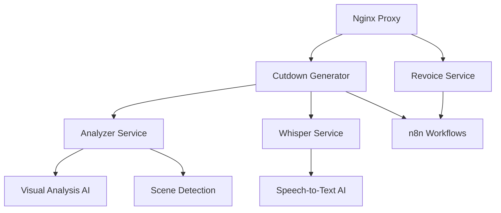

# 🎬 GenCut - Vollständige Projektdokumentation

## 📋 Inhaltsverzeichnis

1. [Projektübersicht](#projektübersicht)
2. [Architektur & Services](#architektur--services)
3. [Detaillierte Code-Analyse](#detaillierte-code-analyse)
4. [Verwaiste Dateien & Code-Bereinigung](#verwaiste-dateien--code-bereinigung)
5. [Code-Qualität & Verbesserungsvorschläge](#code-qualität--verbesserungsvorschläge)
6. [Deployment & Konfiguration](#deployment--konfiguration)
7. [API-Dokumentation](#api-dokumentation)

---

## 📊 Projektübersicht

**GenCut** ist eine microservice-basierte Video-Analyse-Plattform, die Videos automatisch analysiert, Szenen erkennt, Transkriptionen erstellt und intelligente Cutdowns generiert. Das System nutzt AI-Modelle für visuelle Analyse und Audio-Transkription.

### 🏗️ Technologie-Stack

- **Backend**: Python (FastAPI, Flask)
- **AI/ML**: PyTorch, Transformers, YOLO, Whisper
- **Video-Processing**: FFmpeg, OpenCV, PySceneDetect
- **Container**: Docker, Docker Compose
- **Reverse Proxy**: Nginx
- **Frontend**: HTML, TailwindCSS, JavaScript

### 📁 Projektstruktur

```
GenCut/
├── services/                    # Microservices
│   ├── analyzer/               # Video-Analyse & KI
│   ├── cutdown-generator/      # Frontend & Cutdown-Generation
│   ├── revoice/               # Voice & Lip-Sync
│   ├── upload-service/        # Upload-Handler
│   └── whisper/               # Speech-to-Text
├── templates/                  # HTML-Templates
├── static/                     # CSS & Assets
├── docker-compose.yml          # Service-Orchestrierung
├── nginx.conf                  # Reverse Proxy Config
└── build-and-run.sh           # Setup-Script
```

---

## 🏛️ Architektur & Services

### 🔄 Service-Architektur

Das System folgt einer **Microservices-Architektur** mit klarer Trennung der Verantwortlichkeiten:



### 📦 Service-Details

#### 1. **Analyzer Service** (Port: 8000)
- **Technologie**: FastAPI, PyTorch, YOLO, BLIP
- **Zweck**: Video-Analyse, Szenen-Erkennung, KI-basierte visuelle Analyse
- **Hauptfunktionen**:
  - Szenen-Erkennung mit PySceneDetect
  - Objekt-Erkennung mit YOLO v8
  - Szenen-Beschreibung mit BLIP
  - Video/Audio-Trennung
  - Screenshot-Generierung

#### 2. **Cutdown Generator** (Port: 5679)
- **Technologie**: Flask, Gunicorn
- **Zweck**: Frontend, Upload-Handling, Cutdown-Orchestrierung
- **Hauptfunktionen**:
  - Video-Upload-Interface
  - n8n Webhook-Integration
  - Status-Monitoring
  - ElevenLabs Voice-Integration
  - Musik-Generation Proxy

#### 3. **Whisper Service** (Port: 9000)
- **Technologie**: FastAPI, OpenAI Whisper
- **Zweck**: Audio-zu-Text Transkription
- **Hauptfunktionen**:
  - Mehrsprachige Transkription
  - Spracherkennung
  - Segment-basierte Analyse

#### 4. **Revoice Service** (Port: 5682)
- **Technologie**: Flask
- **Zweck**: Video-Upload für Lip-Sync und Voice-Replacement
- **Hauptfunktionen**:
  - Video-Upload für Revoicing
  - ElevenLabs Voice-Integration
  - Session-Management
  - n8n Lip-Sync Workflow-Integration

#### 5. **Upload Service** (Port: 5679)
- **Technologie**: Flask
- **Zweck**: Legacy Upload-Handler für Lip-Sync
- **Status**: ⚠️ **Potentiell veraltet** - Überschneidung mit anderen Services

---

## 🔍 Detaillierte Code-Analyse

### 📄 Analyzer Service (`services/analyzer/`)

#### `main.py` - Haupt-API-Server
```python
# Zentrale FastAPI-Anwendung mit 15 Endpunkten
# Wichtigste Funktionen:

@app.post("/analyze")           # Video-Analyse mit KI
@app.post("/analyze-path")      # Analyse von Dateipfaden
@app.post("/separate-path")     # Video/Audio-Trennung
@app.post("/cutdown-path")      # Video-Schnitt
@app.post("/generate-cutdown")  # Cutdown-Generierung
```

**Code-Qualität**: ⭐⭐⭐ (Gut)
- Umfangreiche Funktionalität
- Gute Fehlerbehandlung
- Dokumentierte Funktionen

**Verbesserungspotential**:
- Sehr lange Datei (800+ Zeilen)
- Gemischte Verantwortlichkeiten
- Fehlende Type-Hints in einigen Funktionen

#### `visual_analysis.py` - KI-Modell-Integration
```python
class VisualAnalyzer:
    def __init__(self):
        self.models_initialized = False
        self.scene_description_model = None  # BLIP
        self.object_detection_model = None   # YOLO
        
    async def analyze_image(self, image_path: str) -> dict:
        # Kombiniert BLIP + YOLO für vollständige Analyse
```

**Code-Qualität**: ⭐⭐⭐⭐ (Sehr gut)
- Saubere Klassenstruktur
- Async/Await korrekt implementiert
- Gute Modell-Abstraktion

#### `scene_utils.py` - Szenen-Erkennung
```python
def analyze_scenes(video_path: str, threshold: float | None = None, 
                  min_scene_len: int | None = None):
    # PySceneDetect + OpenCV für Screenshot-Generierung
    # Optimiert für Performance (nur mittlere Frames)
```

**Code-Qualität**: ⭐⭐⭐⭐ (Sehr gut)
- Klare Funktion
- Gute Performance-Optimierungen
- Konfigurierbare Parameter

#### `ffmpeg_utils.py` - Video-Processing
```python
def cut_clip(input_path, output_path, start_time, end_time):
    # FFmpeg-Integration für Video-Schnitt
    # Validierung und Fehlerbehandlung
    
def separate_video_audio(video_path, output_dir):
    # Trennung von Video/Audio-Streams
```

**Code-Qualität**: ⭐⭐⭐ (Gut)
- Robuste FFmpeg-Integration
- Gute Validierung
- Ausführliche Logging

### 📄 Cutdown Generator (`services/cutdown-generator/`)

#### `app.py` - Frontend & Orchestrierung
```python
# Flask-Anwendung mit 15+ Endpunkten
# Hauptfunktionen:

@app.route('/upload', methods=['POST'])     # Video-Upload
@app.route('/check-status', methods=['POST']) # Status-Prüfung
@app.route('/generate-music', methods=['POST']) # Musik-Generation
@app.route('/elevenlabs/*')                 # Voice-Integration
```

**Code-Qualität**: ⭐⭐⭐ (Gut)
- Umfangreiche Funktionalität
- n8n Integration
- ElevenLabs API-Integration

**Kritische Punkte**:
- **Hardcodierter API-Key**: `ELEVENLABS_API_KEY = 'sk_76fa...'`
- Sehr lange Datei (630+ Zeilen)
- Gemischte Verantwortlichkeiten

### 📄 Whisper Service (`services/whisper/`)

#### `main.py` - Speech-to-Text
```python
@app.post("/asr")
async def transcribe_audio(audio_file: UploadFile = File(...), 
                          language_code: str = Form(None)):
    # OpenAI Whisper Integration
    # Temporäre Datei-Verarbeitung
```

**Code-Qualität**: ⭐⭐⭐⭐⭐ (Exzellent)
- Sehr sauberer, fokussierter Code
- Korrekte Async-Implementation
- Gute Ressourcen-Verwaltung

### 📄 Revoice Service (`services/revoice/`)

#### `app.py` - Voice & Lip-Sync
```python
# Flask-Service für Revoicing
# ElevenLabs Integration
# n8n Webhook-Integration

@app.route('/upload', methods=['POST'])
@app.route('/status/<video_id>')
@app.route('/elevenlabs/voices')
```

**Code-Qualität**: ⭐⭐⭐ (Gut)
- Klare Service-Trennung
- Session-Management
- ElevenLabs Integration

**Kritische Punkte**:
- **Hardcodierter API-Key**: `ELEVENLABS_API_KEY = 'sk_76fa...'`
- Duplikation mit anderen Services

---

## 🗑️ Verwaiste Dateien & Code-Bereinigung

### 📂 Identifizierte verwaiste Dateien:

#### 1. **`templates_old/` Verzeichnis**
```
templates_old/
├── index.html          # ⚠️ Veraltet
├── input.css          # ⚠️ Duplikat
├── tailwind.css       # ⚠️ Duplikat
├── static/tailwind.css # ⚠️ Duplikat
└── testfile.txt       # ⚠️ Test-Datei
```
**Empfehlung**: Komplettes Verzeichnis löschen

#### 2. **Service-Duplikation**
- `services/upload-service/` vs `services/cutdown-generator/`
- Beide haben ähnliche Upload-Funktionalität
- `upload-service` scheint Legacy zu sein

#### 3. **Konfiguration-Inkonsistenzen**
- `services/cutdown-generator/package.json`: Name ist noch "upload-service-frontend"
- Storybook-Service ist auskommentiert aber Build-Script vorhanden

#### 4. **Ungenutzte Container**
- `imagebind-embed` Service definiert aber nicht aktiv genutzt
- Referenziert externes Verzeichnis `../imagebind-video-embed`

### 🧹 Bereinigungsplan:

1. **Sofort löschen**:
   - `templates_old/` komplett
   - `services/upload-service/` (nach Funktions-Migration)

2. **Konfiguration korrigieren**:
   - `package.json` Namen aktualisieren
   - Storybook-Konfiguration bereinigen

3. **Service-Konsolidierung**:
   - Upload-Funktionalität in `cutdown-generator` konsolidieren
   - Doppelte ElevenLabs-Integration vereinheitlichen

---

## 📊 Code-Qualität & Verbesserungsvorschläge

### 🔴 Kritische Sicherheitsprobleme

#### 1. **Hardcodierte API-Keys**
```python
# services/cutdown-generator/app.py:17
ELEVENLABS_API_KEY = os.environ.get('ELEVENLABS_API_KEY', 'sk_76fa8e172a657a24769b7714e73bf966e1e3297583c6a7ca')

# services/revoice/app.py:45
ELEVENLABS_API_KEY = 'sk_76fa8e172a657a24769b7714e73bf966e1e3297583c6a7ca'
```

**Lösung**:
```python
# Sicher: Nur Umgebungsvariable, kein Fallback
ELEVENLABS_API_KEY = os.environ.get('ELEVENLABS_API_KEY')
if not ELEVENLABS_API_KEY:
    raise ValueError("ELEVENLABS_API_KEY Umgebungsvariable ist erforderlich")
```

#### 2. **Debug-Modus in Produktion**
```python
# Mehrere Services haben DEBUG=True
app.config.update(DEBUG=True, ENV='development')
```

### 🟡 Code-Qualitätsprobleme

#### 1. **Lange Funktionen/Dateien**
- `analyzer/main.py`: 800+ Zeilen
- `cutdown-generator/app.py`: 630+ Zeilen
- `generate_cutdown_v2()`: 200+ Zeilen

**Lösung**: Aufteilen in kleinere Module/Funktionen

#### 2. **Fehlende Type-Hints**
```python
# Vorher
def time_string_to_seconds(time_str):
    
# Nachher  
def time_string_to_seconds(time_str: str) -> float:
```

#### 3. **Inkonsistente Fehlerbehandlung**
```python
# Manchmal:
try:
    # code
except Exception as e:
    print(f"Error: {e}")
    
# Besser:
try:
    # code
except SpecificException as e:
    logger.error(f"Specific error: {e}")
    raise HTTPException(status_code=500, detail=str(e))
```

#### 4. **Code-Duplikation**
- ElevenLabs Integration in 2 Services
- Upload-Logik mehrfach implementiert
- Ähnliche Fehlerbehandlung überall

### 🟢 Positive Aspekte

#### 1. **Gute Service-Trennung**
- Klare Verantwortlichkeiten
- Microservice-Architektur
- Docker-Integration

#### 2. **Robuste AI-Integration**
- Async/Await korrekt verwendet
- Modell-Initialisierung gut abstrahiert
- GPU/CPU Fallback implementiert

#### 3. **Umfangreiche API**
- Viele nützliche Endpunkte
- Gute HTTP-Status-Codes
- JSON-Responses standardisiert

### 🔧 Verbesserungsvorschläge

#### 1. **Sicherheit**
```python
# Environment-based Konfiguration
class Config:
    ELEVENLABS_API_KEY = os.environ.get('ELEVENLABS_API_KEY')
    DEBUG = os.environ.get('DEBUG', 'False').lower() == 'true'
    LOG_LEVEL = os.environ.get('LOG_LEVEL', 'INFO')
```

#### 2. **Code-Struktur**
```python
# Aufteilen in Module
services/analyzer/
├── main.py              # Nur API-Endpunkte
├── models/
│   ├── visual_analysis.py
│   └── scene_detection.py
├── utils/
│   ├── ffmpeg_utils.py
│   └── file_utils.py
└── config.py           # Zentrale Konfiguration
```

#### 3. **Logging**
```python
import logging
import structlog

# Strukturiertes Logging
logger = structlog.get_logger(__name__)

def analyze_video(video_path: str):
    logger.info("Starting video analysis", video_path=video_path)
    try:
        # processing
        logger.info("Video analysis completed", 
                   scenes_found=len(scenes))
    except Exception as e:
        logger.error("Video analysis failed", 
                    error=str(e), video_path=video_path)
```

#### 4. **Testing**
```python
# Unit Tests hinzufügen
tests/
├── test_analyzer.py
├── test_whisper.py
├── test_integration.py
└── fixtures/
    └── sample_video.mp4
```

#### 5. **Dokumentation**
```python
def analyze_scenes(video_path: str, threshold: float = 18.0, 
                  min_scene_len: int = 8) -> List[Scene]:
    """
    Analysiert Video und erkennt Szenen-Übergänge.
    
    Args:
        video_path: Pfad zur Video-Datei
        threshold: Sensitivität für Szenen-Erkennung (höher = weniger Szenen)
        min_scene_len: Minimale Szenen-Länge in Frames
        
    Returns:
        Liste von Scene-Objekten mit Screenshots und Metadaten
        
    Raises:
        FileNotFoundError: Wenn Video-Datei nicht existiert
        ValueError: Bei ungültigen Parametern
    """
```

---

## 🚀 Deployment & Konfiguration

### 📋 Docker-Compose-Analyse

#### Services-Übersicht:
```yaml
services:
  gencut-frontend:      # Port 5679 (Cutdown Generator)
  revoice:             # Port 5682 (Revoice Service)
  analyzer:            # Port 8000 (Video Analysis)
  whisper:             # Port 9000 (Speech-to-Text)
  imagebind-embed:     # Port 8750 (Nicht aktiv genutzt)
  nginx:               # Port 5679 (Reverse Proxy)
```

#### Netzwerk-Architektur:
```yaml
networks:
  n8n-network:         # Externe Integration
  video-network:       # Interne Service-Kommunikation
```

#### Volume-Management:
```yaml
volumes:
  static_data:         # CSS/JS Assets
  videos_data:         # Video-Dateien (geteilt)
```

### 🔧 Nginx-Konfiguration

```nginx
# nginx.conf - Reverse Proxy Setup
server {
    listen 5679;
    client_max_body_size 2g;  # Große Video-Uploads
    
    location /static/ {
        alias /app/static/;
    }
    
    location /videos/ {
        alias /app/videos/;
        # Video-Streaming optimiert
    }
    
    location / {
        proxy_pass http://gencut-frontend:5679;
        proxy_read_timeout 300s;  # Lange Verarbeitung
    }
}
```

### 🛠️ Build & Setup

#### `build-and-run.sh` - Automatisiertes Setup
```bash
# Vollständiges Setup in einem Script
# ✅ Netzwerk-Erstellung
# ✅ Service-Building
# ✅ Health-Checks
# ✅ Status-Übersicht
```

**Verbesserungen**:
- Health-Check-Timeout erhöhen
- Bessere Fehlerbehandlung bei Service-Ausfällen
- Log-Aggregation hinzufügen

---

## 📚 API-Dokumentation

### 🔍 Analyzer Service (Port: 8000)

#### POST `/analyze`
**Zweck**: Vollständige Video-Analyse mit KI
```json
// Request: multipart/form-data
{
  "file": "video.mp4"
}

// Response:
{
  "video_id": "uuid",
  "filename": "video.mp4",
  "scenes": [
    {
      "scene": 0,
      "start_time": "00:00:00.000",
      "end_time": "00:00:05.123",
      "screenshots": [
        {
          "url": "/videos/screenshots/video/scene_000_frame_000.jpg",
          "timestamp": "0:00:01.500000",
          "frame_number": 45
        }
      ]
    }
  ]
}
```

#### POST `/separate-path`
**Zweck**: Video/Audio-Trennung
```json
// Request:
{
  "file": "/app/videos/uploads/video.mp4"
}

// Response:
{
  "filename": "video.mp4",
  "video_url": "/separated/video_video.mp4",
  "audio_url": "/separated/video_audio.mp3"
}
```

#### POST `/generate-cutdown-v2`
**Zweck**: Cutdown aus ausgewählten Szenen
```json
// Request:
{
  "selected_scenes": [
    {
      "start_time": "00:00:10.000",
      "end_time": "00:00:15.000",
      "video_url": "/videos/uploads/video.mp4"
    }
  ],
  "audio_file": "http://example.com/music.mp3",
  "original_video": "/app/videos/uploads/video.mp4"
}

// Response:
{
  "output_url": "/videos/cutdowns/generated_cutdown.mp4"
}
```

### 🎙️ Whisper Service (Port: 9000)

#### POST `/asr`
**Zweck**: Audio-zu-Text Transkription
```json
// Request: multipart/form-data
{
  "audio_file": "audio.mp3",
  "language_code": "de"  // Optional
}

// Response:
{
  "text": "Transkribierter Text",
  "language": "de",
  "segments": [
    {
      "start": 0.0,
      "end": 5.0,
      "text": "Segment-Text"
    }
  ]
}
```

### 🎬 Cutdown Generator (Port: 5679)

#### POST `/upload`
**Zweck**: Video-Upload für Cutdown-Generation
```json
// Request: multipart/form-data
{
  "video": "video.mp4",
  "cutdown_options": {
    "length": "60",
    "style": "highlight",
    "focus": ["action"]
  },
  "prompt": "Erstelle einen actionreichen Cutdown"
}

// Response:
{
  "success": true,
  "video_id": "uuid",
  "filename": "uuid_video.mp4",
  "status": "uploaded",
  "webhook_status": "success"
}
```

#### POST `/check-status`
**Zweck**: Verarbeitungsstatus prüfen
```json
// Request:
{
  "video_id": "uuid"
}

// Response:
{
  "status": "completed|processing|failed",
  "message": "Status-Beschreibung",
  "cutdown_path": "/videos/cutdowns/result.mp4"  // Falls fertig
}
```

### 🔊 Revoice Service (Port: 5682)

#### POST `/upload`
**Zweck**: Video-Upload für Revoicing
```json
// Request: multipart/form-data
{
  "video": "video.mp4"
}

// Response:
{
  "success": true,
  "video_id": "revoice_timestamp_hash",
  "filename": "revoice_id.mp4",
  "status": "processing"
}
```

#### GET `/elevenlabs/voices`
**Zweck**: Verfügbare Stimmen abrufen
```json
// Response:
[
  {
    "voice_id": "voice_id",
    "name": "Voice Name",
    "labels": {"gender": "male", "age": "adult"},
    "description": "Voice description",
    "category": "premade"
  }
]
```

---

## 📈 Performance & Monitoring

### 🔍 Performance-Optimierungen

#### 1. **Video-Processing**
- FFmpeg mit `ultrafast` Preset
- Screenshot-Kompression (JPEG Quality 85)
- Nur mittlere Frames pro Szene analysiert

#### 2. **AI-Modell-Optimierung**
- GPU/CPU Fallback
- Modell-Caching
- Async-Verarbeitung

#### 3. **File-Handling**
- Temporäre Dateien automatisch bereinigt
- Streaming für große Dateien
- Nginx-Optimierung für Video-Serving

### 📊 Monitoring-Endpunkte

```python
# Health-Check-Endpunkte in allen Services
GET /health

// Beispiel-Response:
{
  "status": "healthy",
  "service": "analyzer",
  "timestamp": 1234567890,
  "models_loaded": true,
  "gpu_available": false
}
```

---

## 🎯 Empfohlene Nächste Schritte

### 🔴 Kritisch (Sofort):
1. **API-Keys aus Code entfernen**
2. **Debug-Modus deaktivieren**
3. **Verwaiste Dateien löschen**

### 🟡 Hoch (Diese Woche):
1. **Code in Module aufteilen**
2. **Einheitliche Fehlerbehandlung**
3. **Service-Duplikation bereinigen**

### 🟢 Mittel (Nächste Iteration):
1. **Unit-Tests hinzufügen**
2. **Logging verbessern**
3. **Performance-Monitoring**

### 🔵 Niedrig (Langfristig):
1. **OpenAPI-Dokumentation**
2. **CI/CD Pipeline**
3. **Load-Balancing**

---

## 📞 Fazit

**GenCut** ist ein **funktionales und gut strukturiertes** Video-Analyse-System mit moderner Microservice-Architektur. Die AI-Integration ist robust implementiert und die Service-Trennung ist sauber durchgeführt.

**Hauptstärken**:
- ✅ Vollständige AI-Pipeline (Vision + Audio)
- ✅ Saubere Docker-Integration
- ✅ Umfangreiche API
- ✅ n8n Workflow-Integration

**Kritische Verbesserungen**:
- 🔴 Sicherheitsprobleme (API-Keys)
- 🔴 Code-Bereinigung erforderlich
- 🔴 Service-Duplikation

**Gesamtbewertung**: ⭐⭐⭐⭐ (4/5) - Sehr gut mit Verbesserungspotential

Mit den empfohlenen Verbesserungen kann das System auf **Produktionsniveau** gebracht werden.